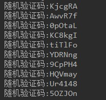
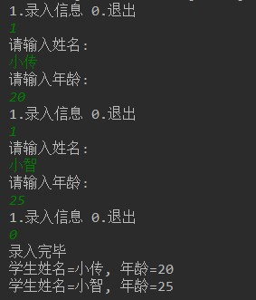
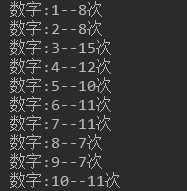
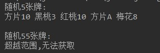
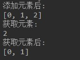

# 基础题目

## 第一题：需求实现

* 随机验证码。

  * 随机生成十组六位字符组成的验证码。
  * 验证码由大小写字母、数字字符组成。

* 代码实现，效果如图所示：

  

* 开发提示：

  * 使用字符数组保存原始字符，利用Random类生成随机索引。

* 参考答案：


```java

	public class Test1 {
	    public static void main(String[] args) {
	        for (int i = 0; i < 10; i++) {
	            String s = verifyCode();
	            System.out.println("随机验证码:" + s);
	        }
	    }
	    public static String verifyCode() {
	        char[] arr = {'0', '1', '2', '3', '4', '5', '6', '7', '8', '9', 'A', 'B', 'C', 'D', 'E', 'F', 'G', 'H', 'I', 'J', 'K', 'L', 'M', 'N', 'O', 'P', 'Q', 'R', 'S', 'T', 'U', 'V', 'W', 'X', 'Y', 'Z', 'a', 'b', 'c', 'd', 'e', 'f', 'g', 'h', 'i', 'j', 'k', 'l', 'm', 'n', 'o', 'p', 'q', 'r', 's', 't', 'u', 'v', 'w', 'x', 'y', 'z'};
	
	        Random random = new Random();
	        String code  = "";
	        for (int i = 0; i < 6; i++) {
	            int index  = random.nextInt(arr.length);
	           code  += arr[index];
	
	        }
	        return code;
	    }
	}
```

## 第二题：需求实现

* 键盘录入学生信息，保存到集合中。
  * 循环录入的方式，1：表示继续录入，0：表示结束录入。
  * 定义学生类，属性为姓名，年龄，使用学生对象保存录入数据。
  * 使用ArrayList集合，保存学生对象，录入结束后，遍历集合。


* 代码实现，效果如图所示：

  


* 参考答案：


```java

	public class Test2 {
	    public static void main(String[] args) {
	        Scanner scanner = new Scanner(System.in);
	        ArrayList<Student> list = new ArrayList<>();
	        while (true) {
	            System.out.println("1.录入信息 0.退出");
	            int i = scanner.nextInt();
	            switch (i) {
	                case 1:
	                    inputStu(list , scanner);
	                    break;
	                case 0:
	                    System.out.println("录入完毕");
	            }
	            if (i == 0){
	                break;
	            }
	        }
	
	        for (int i = 0; i < list.size(); i++) {
	            Student student = list.get(i);
	            student.show();
	        }
	    }
	
	    private static void inputStu(ArrayList<Student> list , Scanner sc) {
	        System.out.println("请输入姓名:");
	        String name = sc.next();
	        System.out.println("请输入年龄:");
	        int age = sc.nextInt();
	        Student student = new Student(name, age);
	        list.add(student);
	    }
	}
	
	class Student{
	    private String name;
	    private int age;
	    public Student() {
	    }
	    public Student(String name, int age) {
	        this.name = name;
	        this.age = age;
	    }
	    public String getName() {
	        return name;
	    }
	    public void setName(String name) {
	        this.name = name;
	    }
	    public int getAge() {
	        return age;
	    }
	    public void setAge(int age) {
	        this.age = age;
	    }
	    public void show() {
	        System.out.println( "学生姓名=" + name + ", 年龄=" + age);
	    }
	}
```
## 第三题：需求实现

* 集合工具类。
  * 定义findIndex方法，在某集合中，查找某元素，返回第一次出现的索引。
  * 定义replace方法，将某集合中的某元素，全部替换为新元素。


* 代码实现，效果如图所示：
  


* 参考答案：


```java

	public class Test3 {
	    public static int findIndex(List<Integer> list, int i){
	        int index = -1;
	        for (int j = 0; j < list.size(); j++) {
	            if (list.get(j) == i) {
	                index = j;
	                break;
	            }
	        }
	        return index;
	    }
	    public static void replace(List<Integer> list,Integer oldValue,Integer newValue){
	        for (int i = 0; i < list.size(); i++) {
	            if (list.get(i) == oldValue) {
	                list.set(i, newValue);
	            }
	        }
	    }
	}
```
## 第四题：需求实现

* 统计数字出现次数。

  * 定义getNumList方法，随机生成100个数字，数字范围从1到10。
  * 定义printCount方法，统计每个数字出现的次数并打印到控制台。

* 代码实现，部分效果如图所示：

  


* 参考答案：


```java

	public class Test4 {
	    public static void main(String[] args) {
	        ArrayList<Integer> numList = getNumList();
	        //  统计字符数组中字母出现次数
	        printCount(numList);
	    }
	    public static void printCount(ArrayList<Integer> list) {
	        int[] count = new int[10];
	        // 对应保存数字出现的次数
	        for (int i = 0; i < list.size(); i++) {
	            int c = list.get(i);
	            count[c-1]++;
	        }
	        // 打印数字和次数
	        for (int i = 0 ; i < count.length; i++) {
	                System.out.println("数字:"+(i+1) + "--" + count[i]+"次");
	        }
	    }
	    public static ArrayList<Integer> getNumList() {
	        ArrayList<Integer> list = new ArrayList<>();
	        Random r = new Random();
	        for (int i = 0; i < 100; i++) {
	            int x = r.nextInt(10) + 1;
	            list.add(x);
	        }
	        return list;
	    }
	}
```
## 第五题：需求实现

* 模拟统计班级考试分数分布情况，分别统计100-80，79-60，59-40，39-0各个阶段的人数。
  * 定义getScoreList方法，随机生成50个数字，数字范围从0到100。
  * 定义countScore方法，统计各个阶段的分数个数。
  * 定义printCount方法，打印各个阶段的统计结果。


* 代码实现，效果如图所示：

  


* 参考答案：


```java

	public class Test5 {
	    public static void main(String[] args) {
	        // 获取随机分数
	        ArrayList<Integer> scoreList = getScoreList();
	        // 定义计数的变量
	        ArrayList<Integer> countList = countScore(scoreList);
	        // 打印统计结果
	        printCount(countList);
	    }
	
	    private static void printCount(ArrayList<Integer> countList) {
	        int start = 100;
	        int end = 80;
	        for (int i = 0; i < countList.size(); i++) {
	            Integer integer = countList.get(i);
	            System.out.println(start + "\t分 --" + end + " \t分:" + integer+"人");
	            if (i == 0){
	                start-=21;
	                end -=20;
	            }else if (i == countList.size()-2){
	                start-=20;
	                end-=40;
	            }else {
	                start -= 20;
	                end -= 20;
	
	            }
	        }
	    }
	    public static ArrayList<Integer> countScore(ArrayList<Integer> scoreList) {
	        ArrayList<Integer> countList = new ArrayList<>();
	        int count100 = 0;
	        int count79 = 0;
	        int count59 = 0;
	        int count39 = 0;
	
	        for (int i = 0; i < scoreList.size(); i++) {
	            Integer score = scoreList.get(i);
	            if (score <= 100 && score >= 80) {
	                count100++;
	            } else if (score <= 79 && score >= 60) {
	                count79++;
	            } else if (score <= 59 && score >= 40) {
	                count59++;
	            } else {
	                count39++;
	            }
	        }
	
	        countList.add(count100);
	        countList.add(count79);
	        countList.add(count59);
	        countList.add(count39);
	
	        return countList;
	    }
	
	
	    public static ArrayList<Integer> getScoreList() {
	        ArrayList<Integer> list = new ArrayList<>();
	        Random r = new Random();
	        for (int i = 0; i < 50; i++) {
	            int x = r.nextInt(100);
	            list.add(x);
	        }
	        return list;
	    }
	}
```
## 第六题：需求实现

* 随机生成n张扑克牌。
* 代码实现，效果如图所示：
  
* 开发提示：
  - 使用集合保存所有的扑克牌对象。
  - 从所有牌中，随机移除n张牌，保存到新集合。
  - 判断n的值，不能超越一副扑克牌的范围。


* 参考答案：


```java

	public class Test6 {
	    public static void main(String[] args) {
	        int n = 5;
	        ArrayList<Card> cards = randomCard(n);
	
	        if (cards != null) {
	            System.out.println("随机"+ n +"张牌:" );
	            for (int i = 0; i < cards.size(); i++) {
	                Card card = cards.get(i);
	                card.showCard();
	            }
	        }else {
	            System.out.println(n+"超越范围,无法获取牌" );
	        }
	
	        System.out.println();
	        System.out.println();
	        int n2 = 55;
	        ArrayList<Card> cards2 = randomCard(n2);
	
	        if (cards2 != null) {
	            System.out.println("随机"+ n2 +"张牌:" );
	            for (int i = 0; i < cards.size(); i++) {
	                Card card = cards.get(i);
	                card.showCard();
	            }
	        }else {
	            System.out.println("随机"+ n2 +"张牌:\r\n超越范围,无法获取" );
	        }
	    }
	    public static ArrayList<Card> randomCard(int n) {
	        if (n > 54 || n < 0)
	            return null;
	
	        ArrayList<Card> rList = new ArrayList<>();
	        ArrayList<Card> cards = allCard();
	
	        Random r = new Random();
	        for (int i = 0; i < n; i++) {
	            int index = r.nextInt(cards.size());
	            Card rCard = cards.remove(index);
	            rList.add(rCard);
	        }
	        return rList;
	    }
	
	    public static ArrayList<Card> allCard() {
	        ArrayList<Card> allList = new ArrayList<>();
	        // 花色数组
	        String[] hs = {"黑桃", "红桃", "梅花", "方片"};
	        // 点数数组
	        String[] ds = {"A", "2", "3", "4", "5", "6", "7", "8", "9", "10", "J", "Q", "K"};
	
	        for (int H = 0; H < hs.length; H++) {
	            for (int d = 0; d < ds.length; d++) {
	                Card card = new Card(hs[H], ds[d]);
	                // 添加到集合
	                allList.add(card);
	            }
	        }
	        return allList;
	    }
	}
	
	class Card {
	    private String ds; // 点数
	    private String hs; // 花色
	    public Card(String ds, String hs) {
	        this.ds = ds;
	        this.hs = hs;
	    }
	    public void showCard() {
	        System.out.print(ds + hs+" ");
	    }
	}
```


## 第七题：需求实现

* 自定义MyList类，实现存取元素的功能。

  * 定义add方法，可以保存元素，添加MyList尾部。
  * 定义remove方法，可以获取到最后添加的元素，并从MyList中移除该元素。
  * 定义show方法，可以展示MyList中的元素。

* 代码实现，效果如图所示：

  


* 参考答案：


```java

	public class Test7 {
	    public static void main(String[] args) {
	        MyList myList = new MyList();
	        for (int i = 0; i < 3; i++) {
	            myList.add(i);
	        }
	        System.out.println("添加元素后:");
	        myList.show();
	
	        Integer remove = myList.remove();
	        System.out.println("获取元素:");
	        System.out.println(remove);
	        System.out.println("获取元素后:");
	        myList.show();
	    }
	}
	
	class MyList {
	    ArrayList<Integer> ml = new ArrayList<>();
	
	    public void add(Integer i) {
	        ml.add(i);
	    }
	    public Integer remove() {
	        Integer remove = ml.remove(ml.size() - 1);
	        return remove;
	    }
	
	    public void show(){
	        System.out.println(ml);
	    }
	}
```