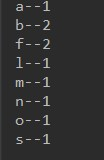

# 基础题目

## 第一题：需求实现

* 模拟大乐透号码：

  * 一组大乐透号码由10个1-99之间的数字组成
  * 定义方法，打印大乐透号码信息

* 代码实现，效果如图所示：

  

* 开发提示：

  * 使用数组保存录入的号码

* 参考答案：

```java

	public class Test1 {
	    public static void main(String[] args) {
	        int[] arr  = {10,20,30,40,50, 60,66,70,80,99};
	        printNum(arr);
	    }
	
	    public static void printNum(int[] arr) {
	        System.out.println("您的大乐透号码为:");
	        for (int i = 0; i < arr.length; i++) {
	            System.out.print(arr[i]+" ");
	        }
	    }
	}
```

## 第二题：需求实现

* 打印扑克牌.


* 代码实现，效果如图所示：

  

* 开发提示：

  * 使用两个字符串数组，分别保存花色和点数

```java

	public class Test2 {
	    public static void main(String[] args) {
	        // 花色数组
	        String[] hs  = {"黑桃","红桃","梅花","方片"};
	        // 点数数组
	        String[] ds = {"A","2","3","4", "5","6","7","8","9","10","J","Q","K"};
	        printCard(hs,ds);
	    }
	    public static void printCard(String[] hs ,String[] ds){
	        for (int hs_index = 0; hs_index < hs.length; hs_index++) {
	            for (int ds_index = 0; ds_index < ds.length; ds_index++) {
	                // 拼接字符串
	                System.out.print(  hs[hs_index] + ds[ds_index]+" ");
	            }
	            // 输出换行
	            System.out.println();
	        }
	    }
	}
```

## 第三题：需求实现

* 模拟在一副牌中，抽取第1张，第5张，第50张扑克牌。

* 代码实现，效果如图所示：

  

* 参考答案：


```java

	public class Test3 {
	    public static void main(String[] args) {
	        // 获取所有扑克牌
	        String[] puke = getPuke();
	
	        // 抽取指定的三种扑克牌
	        int num1 = 1;
	        int num2 = 5;
	        int num3 = 50;
	        String[] pk3 = get3(puke , num1 ,num2,num3);
	        // 打印抽取的牌
	        for (int i = 0; i < pk3.length; i++) {
	            System.out.print(pk3[i] + " ");
	        }
	    }
	
	    private static String[] getPuke() {
	
	        String[] colors={"黑色","红桃","梅花","方块"};
	        String[] nums={"A","2","3","4","5","6","7","8","9","10","J","Q","K"};
	
	        String[] puke = new String[54];
	        int index = 0;
	        for (int i = 0; i < colors.length; i++) {
	            for (int j = 0; j < nums.length; j++) {
	                puke[index] = colors[i]+nums[j];
	                index ++;
	            }
	        }
	        puke[52] = "小王";
	        puke[53] = "大王";
	
	        return puke;
	
	    }
	
	    public static String[] get3(String[] puke, int i, int i2, int i3) {
	        String[] pk3 = new String[3];
	        pk3[0] = puke[i - 1];
	        pk3[1] = puke[i2 - 1];
	        pk3[2] = puke[i3 - 1];
	        return pk3;
	    }
	}
```

## 第四题：需求实现

* 统计字符

  * 字符数组：{'a','l','f','m','f','o','b','b','s','n'}
  * 定义printCount方法，统计每个字符出现的次数并打印到控制台。

* 代码实现，部分效果如图所示：

  

* 开发提示：

  * 将数字强制转换，根据ASCII码表转换为字符。
  * 可以定义长度26的数组，每个元素，对应去保存每种字符的出现次数，比如0索引保存a的次数，1索引保存b的次数，以此类推。

* 参考答案：

  ```java

	  public class Test4 {
	      public static void main(String[] args) {
	          //  获取长度100的字符数组
	          char[] charArray = {'a','l','f','m','f','o','b','b','s','n'};
	          //  统计字符数组中字母出现次数
	          printCount(charArray);
	      }
	      public static void printCount(char[] charArray) {
	          int[] count= new int[26];
	          // 对应保存字母出现的次数
	          for (int i = 0; i < charArray.length; i++) {
	              int c  = charArray[i];
	              count[c- 97]++;
	          }
	          // 打印字母和次数
	          for (int i = 0, ch = 97; i < count.length; i++, ch++) {
	              if (count[i] != 0 ) {
	                  System.out.println((char) ch + "--" + count[i]);
	              }
	          }
	      }
	  }
  ```


## 第五题：需求实现

* 统计高于平均分的分数有多少个。
  * 定义数组[95, 92, 75, 56, 98, 71, 80, 58, 91, 91]。
  * 定义getAvg方法，获取一个数组中的平均数


* 代码实现，效果如图所示：

  

* 参考答案：

  ```java

	  public class Test5 {
	      public static void main(String[] args) {
	          // 获取随机分数
	          int[] score = {95, 92, 75, 56, 98, 71, 80, 58, 91, 91};
	          // 获取平均分
	          int avg = getAvg(score);
	          // 定义计数的变量
	          int count = 0 ;
	          for (int i = 0; i < score.length; i++) {
	              if (score[i] > avg){
	                  count++;
	              }
	          }
	          System.out.println("高于平均分:"+avg+" 的 个数有" + count+" 个");
	      }
	      // 获取平均分的方法
	      public static int getAvg(int[] arr) {
	          int sum = 0;
	          for (int i = 0; i < arr.length; i++) {
	              sum += arr[i];
	          }
	          return sum / arr.length;
	      }  
	  }
  ```

  ​

## 第六题：需求实现

* 定义sym方法，判断数组中的元素值是否对称.

* 代码实现，效果如图所示：

  

* 开发提示：

  * 数组中元素首尾比较。

* 参考答案：

  ```java

	  public class Test6 {
	      public static void main(String[] args) {
	          int[] arr = {1,2,3,4,3,2,1};
	          System.out.println(Arrays.toString(arr) +" 是否对称:" +sym(arr) );
	
	          int[] arr2 = {1,2,3,4,5,2,1};
	          System.out.println(Arrays.toString(arr2) +" 是否对称:" +sym(arr2) );
	      }
	
	      public static boolean sym(int[] arr) {
	          /*
	          start : 数组头
	          end :数组尾 
	           */
	          for (int start = 0 , end = arr.length -1 ; start <= end; start++, end--) {
	              // 如果两端一旦有元素不等,就返回false
	              if (arr[start] != arr[end]) {     
	                  return false;
	              }
	          }
	          return true;
	      }
	  }
  ```

  ​

## 第七题：需求实现

* 定义equals方法，比较数组内容是否完全一致。

* 代码实现，效果如图所示：

  

* 开发提示：

  * 长度一致，内容一致，定义为完全一致。

* 参考答案：

  ```java

	  public class Test7 {
	      public static void main(String[] args) {
	
	          int[] arr = {1,2,3,4,3,2,1};
	          int[] arr2 = {1,2,3,4,3,2,1};
	          System.out.println(" 是否一致:" +equals(arr ,arr2) );
	
	      }
	      //  比较数组的内容
	      public static boolean equals(int[] arr1, int[] arr2) {
	  	// 长度不同,返回false
	          if (arr1.length != arr2.length) {
	              return false;
	          }
	  	
	  	//
	          for (int i = 0; i < arr1.length; i++) {
	              // arr1[i] 和 arr2[i]比较
	              /*
	               * 所有元素都相同才相同，也就是只要有一个不同，这两个数组就是不同
	               */
	              if (arr1[i] != arr2[i]) {
	                  return false;
	              }
	          }
	          return true;
	      }
	  }
  ```

  ​


